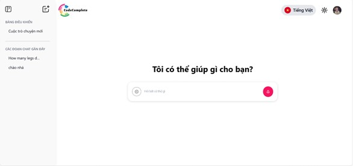

# Reasoning Chains Chatbot



Reasoning Chains Chatbot is an AI-powered chatbot designed to answer user queries using structured reasoning chains. The project leverages FastAPI, Chainlit, and MongoDB to provide a robust, interactive, and scalable chatbot solution.

## Features
- **User Authentication:** Supports login via email/password and Google authentication.
- **Conversation History:** Stores chat history in MongoDB, organized by conversations.
- **AI-Powered Responses:** Utilizes Gemini API to generate intelligent responses.
- **WebSocket Streaming:** Real-time message streaming using Chainlit WebSocket.
- **Frontend Integration:** Built with ReactJS for a seamless user experience.

## Tech Stack
- **Backend:** FastAPI, Chainlit
- **Database:** MongoDB
- **Frontend:** ReactJS
- **Authentication:** JWT, Google OAuth
- **AI Model:** Gemini API
- **Real-time Communication:** WebSocket (Chainlit)
- **Containerization:** Docker, Docker Compose

## Installation
### Prerequisites
Ensure you have the following installed:
- Python 3.8+
- Node.js 18+
- MongoDB
- Docker & Docker Compose

### Backend Setup (FastAPI & Chainlit)
```bash
# Clone the repository
git clone https://gitlab.codecomplete.jp/cc-intern/interns_202502/reasoning_chains.git
cd reasoning_chains_chatbot

# Create a virtual environment
python -m venv venv
source venv/bin/activate  # On Windows use `venv\Scripts\activate`

# Install dependencies
pip install -r requirements.txt

# Set environment variables (Example)
export MONGO_URI="your_mongodb_uri"
export JWT_SECRET="your_secret_key"
export GEMINI_API_KEY="your_gemini_api_key"

# Start FastAPI backend
uvicorn app:app --host 0.0.0.0 --port 8000 --reload

```

### Frontend Setup (ReactJS)
```bash
# Navigate to the frontend directory
cd frontend

# Install dependencies
yarn install  # or `npm install`

# Start the ReactJS frontend
yarn dev  # or `npm run dev`
```

### Docker Setup
```bash
# Build and start the containers
docker-compose up --build -d

# Stop the containers
docker-compose down
```

## Usage
- Open the frontend at `http://localhost:3000`
- Login using email/password or Google OAuth
- Start a conversation with the chatbot
- View past conversations from the history panel


## Deployment
For production deployment, consider using:
- **Backend:** Deploy FastAPI using Azure, AWS, or a cloud provider
- **Frontend:** Deploy ReactJS on Vercel or Netlify
- **Database:** Use MongoDB Atlas for cloud storage


## License
This project is licensed under the MIT License.

---
For any questions or contributions, feel free to open an issue or pull request!

